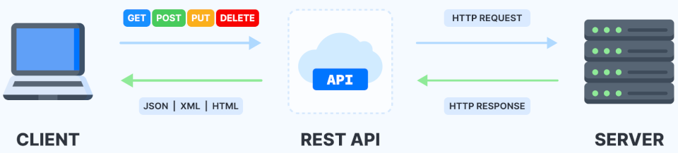

# API REST - Bookstore

<a href="https://nodejs.org/en/" target="_blank"></a>
<a href="https://expressjs.com/pt-br/" target="_blank"></a>
<a href="https://www.mongodb.com/pt-br" target="_blank"></a>
<a href="https://www.postman.com/" target="_blank"></a>

### API (Application Programming Interface)
<p>An API (Application Programming Interface) is a series of routines programmed to <strong>access</strong> software or web platforms. They simplify the development of programs and applications, through the abstraction of the different elements that make up a software, thus allowing the developer to not need to be aware of the implementation details of the system as a whole, he will only need to know how to use the different services provided by the APIs. and how it will communicate with other elements of your software. Think of APIs as a mediator between users or customers and the resources or web services they want to get. APIs also allow organizations to share resources and information while maintaining security, control, and authentication enforcement by allowing them to determine who has access and what can be accessed.</p>

<p>While you are enjoying an application or website, it may be connected to several other systems and applications via APIs without you realizing it. A popular example is the social network Twitter, where you can read and publish messages. Similarly, you can read and post messages on Reddit.</p>

<p>An API is a defined set of HTTP request and response messages, usually expressed in XML or JSON formats. The so-called Web 2.0 has been abandoning the SOAP services model in favor of the REST technique.</p>

### REST (Representational State Transfer)
<p>For an API to be considered RESTful, it must comply with the following criteria:</p>

<li> Have a client/server architecture made up of clients, servers and resources, with requests managed over HTTP.
<li> Establish stateless communication between client and server. This means that no client information is stored between GET requests and all requests are separated and disconnected.
<li> Cache data to optimize client-server interactions.
<li> Have a uniform interface between components so that information is transferred in a standardized format. For that, it is necessary that:
<ul>
	<li type="circle"> the requested resources are identifiable and separate from the representations sent to the client;
	<li type="circle"> the resources can be manipulated by the client through the representation received with sufficient information for such actions;
	<li type="circle"> the self-describing messages returned to the client contain enough information to describe how to process them;
	<li type="circle"> hypertext and hypermedia are available. This means that after accessing a resource, the customer can use hyperlinks to find the other actions currently available to them.
</ul>
<li> Have a tiered system that organizes the types of servers (responsible for security, load loading, and so on) involved in retrieving requested information into hierarchies that the client cannot see.
<li> Enable code on demand (optional): The ability to push executable code from the server to the client when requested to extend the functionality available to the client.

<p>The REST architecture is made up of a set of guidelines that can be implemented as needed. This makes REST APIs faster, lighter, and more scalable, which is ideal for the Internet of Things (IoT) and mobile application development.</p>



## Project
<p>Separating files with different characteristics from those in common, or maintaining a standardization within your code are fundamental concepts for the architecture of the system, and are aspects that must be used in all software development projects. This case is no different, following a common goal, the files are separated into modules, controllers and routes:</p>

```
.
├── node_modules
├── package.json
├── package-lock.json
├── server.js
└── src
    ├── app.js
    ├── config
    │   └── dbConnect.js
    ├── controllers
    │   ├── autoresController.js
    │   └── mangasController.js
    ├── modules
    │   ├── Autor.js
    │   └── Manga.js
    └── routes
        ├── autoresRoutes.js
        ├── index.js
        └── mangasRoutes.js
        
399 directories, 2071 files
```

`sudo su` run as root<br>
`apt-get install tree` install tree<br>
`tree -d` display tree<br>

<p>Next I'll break down the main concepts used to build this file structure, how the backend delivers data to the frontend and how the REST API provides data and resources based on HTTP requests and responses.</p>

### <a href="https://nodejs.org/en/" target="_blank">Node.js</a>

<p>Node.js can be defined as a server-side Javascript execution environment. This means that with Node.js it is possible to create Javascript applications to run as a standalone application on a machine, not depending on a browser for execution, as we are used to.</p>

<p>Despite being recent, Node.js is already used by large companies in the technology market, such as Netflix, Uber and LinkedIn.</p>
<p>The main reason for its adoption is its high scalability. In addition, its architecture, flexibility and low cost make it a good choice for implementing Microservices and Serverless architecture components. Even the main providers of Cloud products and services already support the development of scalable solutions using Node.js.</p>

`node -v` node version<br>
`nvm ls` list installed versions<br>
`nvm install 16.14.0` install version 16.14.0<br>
`nvm use 16.14.0` use version 16.14.0<br>

### <a href="https://expressjs.com/pt-br/" target="_blank">Express.js</a>

<p>Some common tasks in web development are not directly supported by Node. If you want your application to have different HTTP verbs (for example GET, POST, DELETE, etc), manage requests from different URLs ("routes"), present static files or use templates to display responses in a dynamics, you won't have much practicality using just Node. You will have two options. Write the code yourself or avoid all the work of reinventing the wheel by using a framework.</p>

<p>Express is the most popular Node framework and the underlying library for a number of other Node frameworks. Express offers solutions for:</p>
    <li> Manage requests for different HTTP verbs at different URLs.
    <li> Integrate "view engines" to insert data into templates.
    <li> Define common web application settings such as the port to use for connection and the location of templates that are used to render the response.
    <li> Add new request processes through middleware at any point in the request "queue".

<p>Express is quite minimalist, however, developers are free to create specific middleware packages in order to solve specific problems that arise in the development of an application. There are libraries to work with cookies, sessions, user login, URL parameters, data in POST requests, security header and many others. You can find a list of middleware packages maintained by the Express team at Express Middleware (along with a list of popular packages developed by third parties).</p>

`npm init` start npm<br>
`npm install express --save` install express

### URL Resources, HTTP Verbs, and CRUD
<p>The target of an HTTP request is called a "resource", with the nature not yet defined; This could be a document, a photo, or anything else. Each resource is identified by a Uniform Resource Identifier (URI) used by HTTP to identify resources.</p>

<p>The identity and location of resources on the web is provided primarily by a single URL (Uniform Resource Locator, a type of URI). Sometimes the identity and location are not given by the same URI: HTTP uses a specific HTTP header, Alt-Svc when the requested resource wants the client to access it from another location.</p>


<p>Your service will provide a base url and the HTTP verbs will indicate what action is being requested by the service consumer.</p>

<p>For example, considering the URL domain.com/rest/notes/, if we send it an HTTP request using the verb <strong>GET</strong>, we will probably get a list of records as a result (notes, in this case ). On the other hand, if we use the verb <strong>POST</strong>, we are probably trying to add a new record, whose data will be sent in the body of the request.</p>

<p>Likewise, the URL domain.com/rest/notes/1, for example, could be used for different purposes, depending on the verb sent in the request. In the case of <strong>GET</strong>, this URL should probably return us the record ID 1 (in this case, the score ID = 1). The verb <strong>DELETE</strong> would indicate that we want to remove this record.</p>

<p><strong>CRUD</strong> are the four basic functions that generally database handling systems should be able to perform:</p>
<ul>
    <li>C: Create - create a new record
    <li>R: Read - read (display) information from a record
    <li>U: Update - update registry data
    <li>D: Delete - delete a record
</ul>

<p>For example, if you need to develop anything from a simple phone book to a complex order billing management system, you will need to perform these 4 actions to manipulate your system's database tables.</p>

<p>From the developer's point of view, he will need to create the tables (models) of the database, functions (controls) that will update the database and the interfaces (views), such as web page or mobile application, in which the users will interact with the data.</p>

<p>In more sophisticated systems, CRUD data can be manipulated by other systems via API - Application Programming Interface.</p>

<br>
<p>Sources:</p>
	
** -
** -
** -
** -
** -
**
