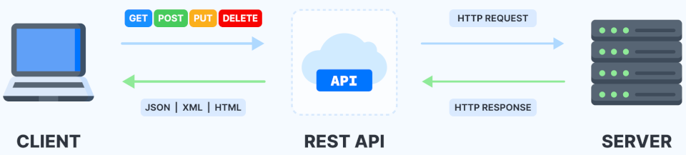
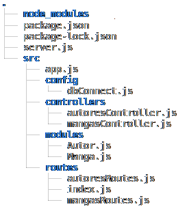

# API REST - Livraria Alura

### API (Interface de Programação de Aplicações)

Este é o repositório da minha primeira experiência construindo uma API! Uma API (Interface de Programação de Aplicações) é uma série de rotinas programadas para <strong>acessar</strong> softwares ou plataformas webs. Elas simplificam o desenvolvimento de programas e aplicações, através da abstração dos diversos elementos que compõem um software, permitindo assim que o desenvolvedor não precise estar ciente dos detalhes da implementação do sistema como um todo, apenas precisará saber como utilizar os diferentes serviços fornecidos pelas APIs .e como se dará a comunicação destas com outros elementos de seu software. Pense nas APIs como um mediador entre os usuários ou clientes e os recursos ou serviços web que eles querem obter. As APIs também servem para que organizações compartilhem recursos e informações e, ao mesmo tempo, mantenham a segurança, o controle e a obrigatoriedade de autenticação, pois permitem determinar quem tem acesso e o que pode ser acessado.

Enquanto você usufrui de um aplicativo ou site, este pode estar conectado a diversos outros sistemas e aplicativos via APIs sem que se perceba. Um exemplo popular é a rede social Twitter, sendo possível ler e publicar mensagens. De maneira semelhante, é possível ler e publicar mensagens no Reddit.

Uma API é um conjunto definido de mensagens de requisição e resposta HTTP, geralmente expresso nos formatos XML ou JSON. A chamada Web 2.0 vem abandonando o modelo de serviços SOAP em favor da técnica REST.

### REST (Transferência de Estado Representacional)

Para que uma API seja considerada do tipo RESTful, ela precisa está em conformidade com os seguintes critérios:

<li> Ter uma arquitetura cliente/servidor formada por clientes, servidores e recursos, com solicitações gerenciadas por HTTP.
<li> Estabelecer uma comunicação stateless entre cliente e servidor. Isso significa que nenhuma informação do cliente é armazenada entre solicitações GET e toda as solicitações são separadas e desconectadas.
<li> Armazenar dados em cache para otimizar as interações entre cliente e servidor.
<ul> 
	<li type="circle"> Ter uma interface uniforme entre os componentes para que as informações sejam transferidas em um formato padronizado. Para tanto, é necessário que:
	<li type="circle"> os recursos solicitados sejam identificáveis e estejam separados das representações enviadas ao cliente;
	<li type="circle"> os recursos possam ser manipulados pelo cliente por meio da representação recebida com informações suficientes para tais ações;
	<li type="circle"> as mensagens autodescritivas retornadas ao cliente contenham informações suficientes para descrever como processá-las;
	<li type="circle"> hipertexto e hipermídia estão disponíveis. Isso significa que após acessar um recurso, o cliente pode usar hiperlinks para encontrar as demais ações disponíveis para ele no momento.
</ul>
<li> Ter um sistema em camadas que organiza os tipos de servidores (responsáveis pela segurança, pelo carregamento de carga e assim por diante) envolvidos na recuperação das informações solicitadas em hierarquias que o cliente não pode ver.
<li> Possibilitar código sob demanda (opcional): a capacidade de enviar um código executável do servidor para o cliente quando solicitado para ampliar a funcionalidade disponível ao cliente.

A arquitetura REST é composta de um conjunto de diretrizes que podem ser implementadas conforme necessário. Isso faz com que as APIs REST sejam mais rápidas, leves e escaláveis, o que é ideal para a Internet das Coisas (IoT) e o desenvolvimento de aplicativos mobile.

## Projeto

Separar arquivos com particularidades distintas das em comum, ou manter uma padronização dentro do seu código são conceitos fundamentais para a arquitetura do sistema, e são aspectos que devem serem utilizados em todos projetos de desenvolvimento de software. Este caso não se difere, seguindo um objetivo em comum, os arquivos estão separados em modules, controllers e routes:

`sudo su` -> executar como root   
`apt-get install tree` -> instalar tree   
`tree -d` -> exibir árvore  

A seguir abortarei os principais diretórios desta estrutura de arquivos, as principais ferramentas e tecnologias utilizadas, como o backend entrega os dados para o frontend e como a API REST é uma interface que vai fornecer os nossos dados e recursos baseados em requisições e respostas HTTP

A seguir abortarei os principais diretórios desta estrutura de arquivos, ferramentas e tecnologias utilizadas, como o backend entrega os dados para o frontend e como a API REST é uma interface que vai fornecer os nossos dados e recursos baseados em requisições e respostas HTTP.

### NodeJS 

O Node.js pode ser definido como um ambiente de execução Javascript server-side. Isso significa que com o Node.js é possível criar aplicações Javascript para rodar como uma aplicação standalone em uma máquina, não dependendo de um browser para a execução, como estamos acostumados.

Apesar de recente, o Node.js já é utilizado por grandes empresas no mercado de tecnologia, como Netflix, Uber e LinkedIn.

O principal motivo de sua adoção é a sua alta capacidade de escala. Além disso, sua arquitetura, flexibilidade e baixo custo, o tornam uma boa escolha para implementação de Microsserviços e componentes da arquitetura Serverless. Inclusive, os principais fornecedores de produtos e serviços Cloud já têm suporte para desenvolvimento de soluções escaláveis utilizando o Node.js.

Fontes:
redhat https://www.redhat.com/pt-br/topics/api/what-is-a-rest-api
wikipedia https://pt.wikipedia.org/wiki/Interface_de_programa%C3%A7%C3%A3o_de_aplica%C3%A7%C3%B5es

Créditos: 

